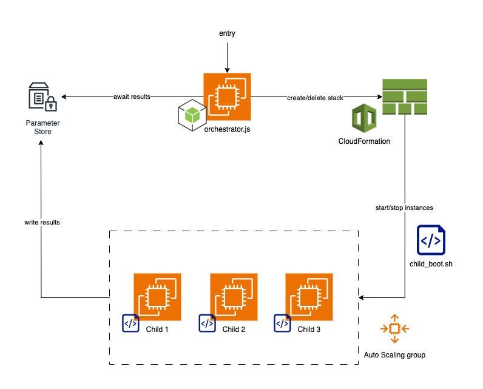

# [LucidLink] Orchestrator Task - Bozhidar Stoyanov

This project provides solution to the problem presented in `Development experience assignment.pdf`.
Namely, an orchestrator that automates a series of file operations (create, copy, delete) across several
virtual machines in an AWS environment. The execution times of these operations are measured and transferred
back to the orchestrator which then reports results for each VM.

### Table of Contents

- [High-level Overview](#high-level-overview)
- [File Structure](#file-structure)
- [Configuration](#configuration)
- [Running the Solution](#running-the-solution)
    - [Launch the orchestrator instance](#launch-the-orchestrator-instance)
    - [Run the script](#run-the-script)
    - [Output](#output)
- [Implementation Details](#implementation-details)
    - [Orchestrator script (`orchestrator.js`)](#orchestrator-script-orchestratorjs)
    - [Child script (`child_boot.sh`)](#child-script-child_bootsh)
- [Possible Improvements](#possible-improvements)

---

## High-level Overview

The solution is implemented using the following technologies and AWS services:

- ***Node.js*** for implementing the orchestrator script, deployed on the _parent_ instance
- ***Bash*** for implementing the payload boot script that performs file operations, deployed on _child_ instances
- ***AWS SSM Parameter Store*** for storing/retrieving the execution time results of operations on child instances
- ***AWS EC2*** for VM instances
- ***AWS EC2 Auto Scaling*** for launching a fixed number of child instances (3 by default) across multiple AZs/subnets
  for high availability
- ***CloudFormation (YAML)*** for deploying and managing AWS resource stacks in an automated and reliable manner



The high-level execution flow is as follows:

1. The orchestrator/parent instance creates a CloudFormation stack with the definition for the child instances, then
   waits for its completion.
2. The child instances are launched by CloudFormation in an Auto Scaling group to benefit from its infrastructural
   reliability and availability across multiple AZs.
3. The bash script that performs the file operations is distributed to child instances via the `UserData` option, and is
   ran upon their booting.
4. In the bash script, after the operations are done, child instances upload time measurements as a comma-delimited
   string to SSM Parameter Store under their unique EC2 instance id.
5. The orchestrator has been waiting for the SSM parameters to be created, and reads them.
6. The orchestrator deletes the CloudFormation stack. It also deletes the SSM parameters.
7. The orchestrator prints the results in either human-readable or JSON format.

---

## File Structure

After cloning the repository, you will see the following file structure:

```
├── Development experience assignment.pdf
├── README.md
├── .env
├── __tests__
│   └── common.test.js
├── images
│   └── architecture_diagram.jpg
├── orchestrator.js
├── orchestrator.yaml
├── package-lock.json
├── package.json
└── src
    ├── child_boot.sh
    ├── child_stack.yaml
    ├── common.js
    ├── fetch-child-results.js
    └── form-child-stack.js
```

Most important are the main `orchestrator.js` file and the `orchestrator.yaml` template file that can be found in the
root folder.
Other `.js` files, as well as the children's `.sh` boot script and their `.yaml` template sit inside the `/src` folder.

---

## Configuration

The orchestrator script allows AWS configurations to be set through environment variables.

By default, those configurations are set via a root-level `.env` file as follows:

```dotenv
AWS_REGION=eu-north-1
CHILD_AMI_ID=ami-02d0a1cbe2c3e5ae4
CHILD_INSTANCE_TYPE=t3.micro
CHILD_NUMBER_OF_INSTANCES=3
CHILD_SUBNET_IDS=#Leave blank for automatic distribution across all available subnets
```

- `AWS_REGION` - the AWS region in which the solution will run (`eu-north-1` by default)
- `CHILD_AMI_ID` - the AMI id for the image to be used for child EC2 instances
  (by default, an Amazon Linux 2023 AMI specific to `eu-north-1`)
- `CHILD_INSTANCE_TYPE` - the EC2 instance type to be used for child instances (`t3.micro` by default)
- `CHILD_NUMBER_OF_INSTANCES` - the number of child instances to be launched (`3` by default)
- `CHILD_SUBNET_IDS` - the id of the subnets across which the child instances should be allocated.
  Can be left blank (which is by default), in which case the script will automatically
  detect all available subnets in the current VPC and use them for the Auto Scaling group.

**<ins>Important: default configurations work only for the `eu-north-1` region!<ins>**

If you want to run the solution in a different region, it would require you to modify
at the very minimum `AWS_REGION` and `CHILD_AMI_ID` as they are region-specific.
So are `CHILD_SUBNET_IDS` if you want to explicitly set them.
`CHILD_INSTANCE_TYPE` can also be region-specific, as `t3-micro`, for example, is not available in all regions.

You can configure AWS variables by modifying the `.env` file (root folder) and setting them to your desired values.

---

## Running the Solution

Use CloudFormation and the provided `orchestrator.yaml` template to run the solution in your AWS environment. This will
automatically launch the orchestrator instance and configure the solution so that you can then simply connect to the
machine and run the script.

As a first step, clone the solution to get hold of the `orchestrator.yaml` file in the root folder.

```shell
git clone https://github.com/iambozhidar/lucidlink-orchestrator.git
```

### Launch the orchestrator instance

***For out-of-the-box experience, run the solution in the `eu-north-1` region.***

1. Go to the CloudFormation console in your AWS account and go to 'Create stack'.
2. Specify `orchestrator.yaml` as the template file by uploading it ('Upload a template file'), and then proceed.
3. Set the stack name. Optionally, change the default values for AMIId and InstanceType.
4. Go until the end of the wizard by clicking 'Next', and then acknowledge and 'Submit' at the end.
5. Wait for the stack to be created. It can take a few minutes.

Alternatively, you can also create the stack with the `orchestrator.yaml` template via AWS CLI.

### Run the script

After the stack has been successfully created (`CREATE_COMPLETE`), go to the EC2 console > 'Instances' and:

1. Connect to the newly created "Orchestrator" instance via Instance Connect
   ('Connect' > 'Connect using EC2 Instance Connect').
2. In the instance terminal, run `ls` to check if the `orchestrator` folder is already in the user space. If not, you
   may need to wait a bit while the solution is being downloaded by the orchestrator's user data script.
3. Once it's there, go inside the folder with `cd orchestrator`.
4. (Optional) If you are in a different region than `eu-north-1` or you want custom AWS configurations, modify `.env`:
    1. Claim ownership of the file via `sudo chown ec2-user .env`
    2. Edit the file with `nano .env`
5. Start the solution via one of the following commands:
    1. `npm start` or `node orchestrator.js` for human-readable output
    2. `npm start -- --json` or `node orchestrator.js --json` for json output
6. Wait for results. It can take a few minutes.

### Output

The output will be in the following format for the human-readable version:

```shell
[ec2-user@ip-172-31-37-219 orchestrator]$ npm start

> lucidlink-orchestrator@1.0.0 start
> node orchestrator.js

Fetching available subnets...
Creating the stack of child instances...
Child instances created with ids:  [ 'i-028fdb82facc7ea66', 'i-048f3a3fc7b510a0b', 'i-051c71d778b29d5a9' ]
Waiting for results... 
Got results. Shutting down instances and deleting resources...
Cleanup done.
Instance 1 results:
- Creation Time: 1854 ms
- Copy Time:     85 ms
- Deletion Time: 64 ms
Instance 2 results:
- Creation Time: 1750 ms
- Copy Time:     58 ms
- Deletion Time: 65 ms
Instance 3 results:
- Creation Time: 1820 ms
- Copy Time:     58 ms
- Deletion Time: 57 ms
```

And if the `--json` option is used:

```shell
[ec2-user@ip-172-31-37-219 orchestrator]$ npm start

> lucidlink-orchestrator@1.0.0 start
> node orchestrator.js

Fetching available subnets...
Creating the stack of child instances...
Child instances created with ids:  [ 'i-03e13706448459c89', 'i-06f36b2b173035f4c', 'i-0fc83e2a8abd6a681' ]
Waiting for results... 
Got results. Shutting down instances and deleting resources...
Cleanup done.
Printing results in JSON format:
[
  {
    "creationTimeMs": 1776,
    "copyTimeMs": 68,
    "deletionTimeMs": 60
  },
  {
    "creationTimeMs": 1835,
    "copyTimeMs": 72,
    "deletionTimeMs": 63
  },
  {
    "creationTimeMs": 2220,
    "copyTimeMs": 60,
    "deletionTimeMs": 73
  }
]
```

---

## Implementation Details

This section presents a few details of the implementation that can bring further clarity about the solution.

### Orchestrator script (`orchestrator.js`)

The boot script (`child_boot.sh`) for the child instances is stored in a separate file and is dynamically inserted into
the `child_stack.yaml` template at runtime. This allows the boot logic to be managed and evolved separately from the
CloudFormation logic.

There is a small unit test suite implemented to cover some util functionality that is hard to test otherwise.
You can run the test from the project's root via `npm test`.

If no/empty subnet ids are configured through `.env` as an environment variable, the script will
automatically fetch all available subnet ids of the current VPC. The default `.env` configuration
with blank subnet ids enable out-of-the-box experience for running the solution.

### Child script (`child_boot.sh`)

Time measurements are taken via the `time` command, more specifically its _real_ or _wall clock_ time in milliseconds -
this gives the actual time it takes for the file operations to complete including IO wait times.

The script's `stdout` and `stderr` streams are logged in a local `/var/log/child_boot.log` file on the child instances
to enable investigations in case problems occur. This provides good overall detectability, since errors on the parent
machine will be visible in the console when executed, and problems on child instances will be visible in the local .log
file. Note: child instances won't be stopped by the parent in case they fail to report results;
you'll need to enable SSH access to child instances to acquire logs.

---

## Possible Improvements

This section includes brief ideas for possible improvements that can be applied to the solution:

- **Spot EC2** instances can be considered for child machines, for cost optimisation purposes.
  AWS can reclaim such instances within a two-minute warning period
  but this is fine considering the fast operations and short lives of child instances.
- **CloudWatch** can be used for centralized logs with enhanced monitoring and alerting capabilities. Currently, child
  EC2 instances write logs in a local file, but logging can be implemented with a CloudWatch agent.
- **Step Functions** can potentially be used to implement the orchestration logic for a more robust and flexible
  serverless solution.